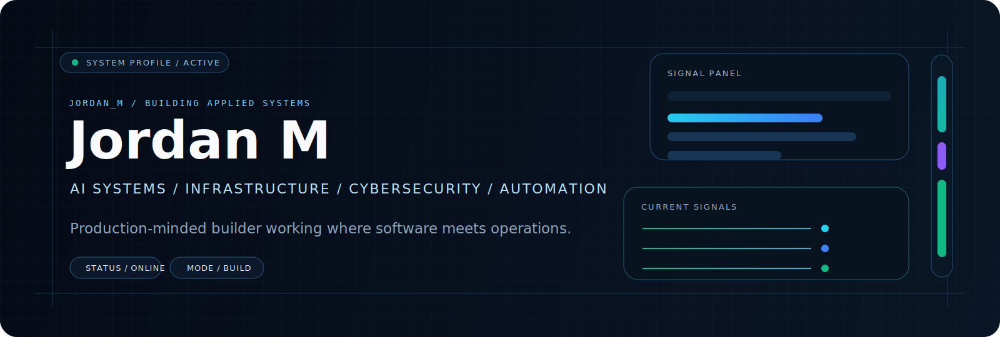
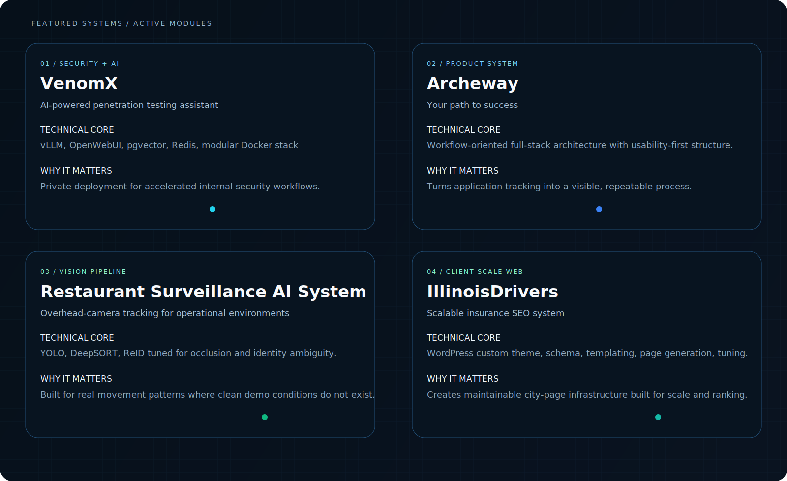
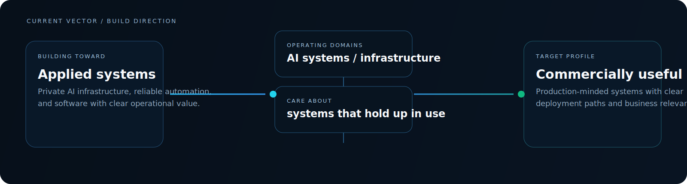
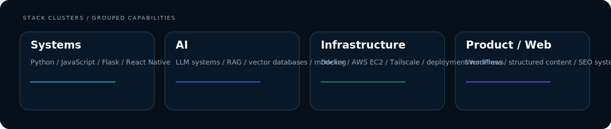

<p align="left">
  
</p>

<p align="left">
  
</p>

## Identity

```txt
jordan@control-surface:~$ whoami
Jordan M

jordan@control-surface:~$ context
builder / production-minded / systems-focused
Drake University / Computer Science + AI
graduating / May 2026

jordan@control-surface:~$ domains --active
AI systems
infrastructure
cybersecurity
automation
scalable applied software
```

<p align="left">
  Shipping systems built for real constraints, operational clarity, and commercial use.
</p>

<p align="left">
  
</p>

## Featured Systems

<p align="left">
  
</p>

<p align="left">
  The work spans private AI infrastructure, workflow software, computer vision in operational environments, and scalable client web systems.
</p>

<p align="left">
  
</p>

## Current Vector

<p align="left">
  
</p>

<p align="left">
  Moving toward applied systems that combine strong architecture, deployment discipline, and business relevance.
</p>

<p align="left">
  
</p>

## Stack

<p align="left">
  
</p>

### Systems

<p>
  
  
  
  
</p>

### AI

<p>
  
  
  
  
</p>

### Infrastructure

<p>
  
  
  
  
</p>

### Product / Web

<p>
  
  
  
  
</p>

<p align="left">
  
</p>

## How I Build

- Build for use, not presentation.
- Treat architecture as part of the product.
- Optimize for clarity under real constraints.
- Use AI and automation where they create leverage.

<p align="left">
  
</p>

## Contact

<p>
  <a href="https://jrdnmartin.com/">
    
  </a>
  <a href="https://www.linkedin.com/in/jrdnmartin/">
    
  </a>
</p>

<p align="left">
  Applied AI, infrastructure, cybersecurity workflows, and automation systems are the center of gravity.
</p>

<!--
jrdnmartin/jrdnmartin is a special repository because its README.md appears on your GitHub profile.
-->
