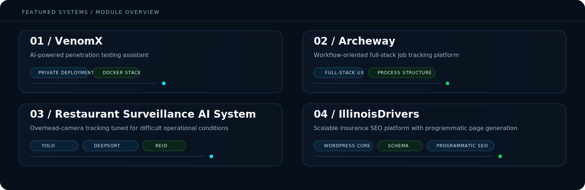

<p align="left">
  
</p>

<p align="left">
  
</p>

<table>
  <tr>
    <td width="56%" valign="top">

```txt
jordan@system:~$ id
Jordan M

jordan@system:~$ context --operating
role        : builder
domain      : AI systems / infrastructure / cybersecurity / automation
base        : Drake University
track       : Computer Science + AI
milestone   : graduating May 2026

jordan@system:~$ status
shipping systems designed for real constraints
```

    </td>
    <td width="44%" valign="top">
      <h3>Operating Context</h3>
      <p>I build applied systems with a bias toward production realities: private AI stacks, deployment workflows, automation layers, and software that is meant to hold up under use.</p>
      <p>The direction is simple: build commercially useful software, deepen infrastructure and AI capability, and keep moving toward work where technical depth creates leverage.</p>
    </td>
  </tr>
</table>

<p align="left">
  
</p>

## Featured Systems

<p align="left">
  
</p>

<table>
  <tr>
    <td width="50%" valign="top">
      <h3>VenomX</h3>
      <p><strong>AI-powered penetration testing assistant</strong></p>
      <p>Built as a private, internal security system using a local LLM stack and modular Docker architecture.</p>
      <p><strong>Technical core:</strong> vLLM, OpenWebUI, pgvector, Redis, Docker</p>
      <p><strong>Operational value:</strong> accelerates cybersecurity workflows without depending on external hosted tooling.</p>
    </td>
    <td width="50%" valign="top">
      <h3>Archeway</h3>
      <p><strong>Your path to success</strong></p>
      <p>A workflow-oriented job tracking platform built to make progress visible and the application process more systematic.</p>
      <p><strong>Technical core:</strong> full-stack architecture, structured workflow design, usability-focused interface patterns</p>
      <p><strong>Operational value:</strong> turns a chaotic process into a repeatable system users can actually stay engaged with.</p>
    </td>
  </tr>
  <tr>
    <td width="50%" valign="top">
      <h3>Restaurant Surveillance AI System</h3>
      <p><strong>Computer vision pipeline for operational environments</strong></p>
      <p>Designed for overhead-camera tracking with high accuracy in the presence of occlusion, identity ambiguity, and real movement complexity.</p>
      <p><strong>Technical core:</strong> YOLO, DeepSORT, ReID</p>
      <p><strong>Operational value:</strong> supports real-world efficiency and monitoring with tracking logic tuned for difficult conditions.</p>
    </td>
    <td width="50%" valign="top">
      <h3>IllinoisDrivers</h3>
      <p><strong>Client system for scalable insurance SEO</strong></p>
      <p>A multi-state web platform built on a custom WordPress theme with programmatic page generation and data-driven content structure.</p>
      <p><strong>Technical core:</strong> templating systems, schema, performance tuning, scalable city-page generation</p>
      <p><strong>Operational value:</strong> creates rankable, maintainable growth infrastructure at scale.</p>
    </td>
  </tr>
</table>

<p align="left">
  
</p>

## Build Direction

<table>
  <tr>
    <td width="50%" valign="top">

```yaml
system_status:
  state: online
  priority:
    - AI systems
    - infrastructure rigor
    - cybersecurity workflows
    - automation with operational value
  target:
    - commercially useful software
    - freelance / business-oriented development
```

    </td>
    <td width="50%" valign="top">

```txt
roadmap.now    -> stronger private AI + local inference systems
roadmap.next   -> deeper deployment and infrastructure workflows
roadmap.after  -> more business-aligned software delivery
roadmap.long   -> systems with clear operational and commercial impact
```

    </td>
  </tr>
</table>

<p align="left">
  
</p>

## Technical Stack

<table>
  <tr>
    <td width="33%" valign="top">
      <h3>Application</h3>
      <p>Python, JavaScript, Flask, React Native</p>
    </td>
    <td width="33%" valign="top">
      <h3>Systems</h3>
      <p>Docker, AWS EC2, Tailscale, deployment workflows</p>
    </td>
    <td width="33%" valign="top">
      <h3>AI + Data</h3>
      <p>LLMs, local inference, RAG, vector databases, analysis and modeling</p>
    </td>
  </tr>
</table>

<p>
  
  
  
  
  
  
  
  
  
  
  
</p>

<p align="left">
  
</p>

## How I Build

<table>
  <tr>
    <td width="33%" valign="top">
      <h3>Useful over performative</h3>
      <p>If a system cannot survive deployment, maintenance, or edge cases, it is not finished.</p>
    </td>
    <td width="33%" valign="top">
      <h3>Architecture is part of the product</h3>
      <p>Interfaces matter, but workflows, observability, reliability, and structure matter just as much.</p>
    </td>
    <td width="33%" valign="top">
      <h3>Depth should create leverage</h3>
      <p>AI, infrastructure, and automation should reduce friction and increase capability, not add noise.</p>
    </td>
  </tr>
</table>

<p align="left">
  
</p>

## Contact

<p>
  <a href="https://jrdnmartin.com/">
    
  </a>
  <a href="https://www.linkedin.com/in/jrdnmartin/">
    
  </a>
</p>

<p>If the work involves applied AI, infrastructure, cybersecurity workflows, automation, or scalable software systems, I am interested.</p>

<!--
jrdnmartin/jrdnmartin is a special repository because its README.md appears on your GitHub profile.
-->
